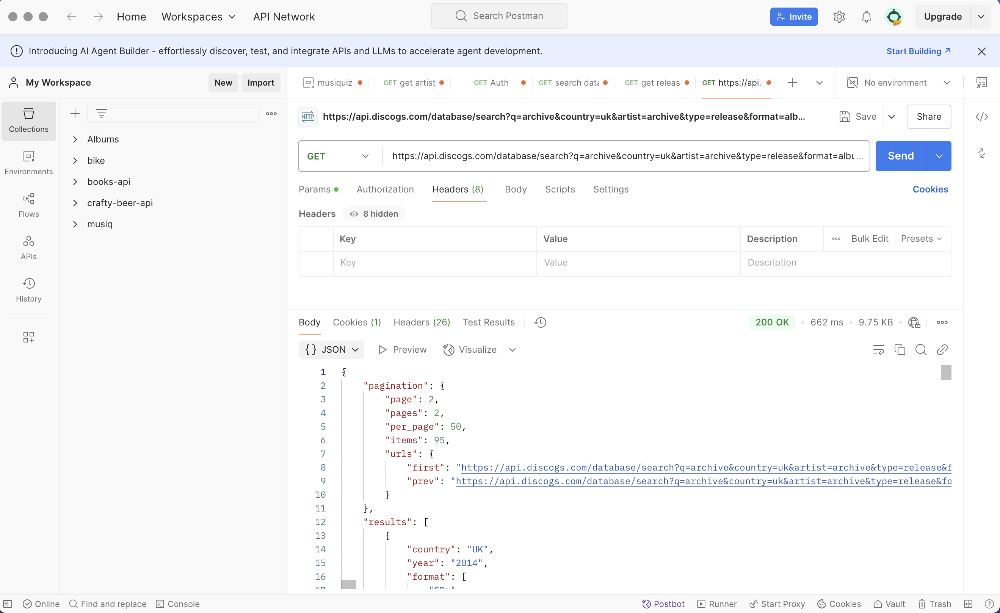
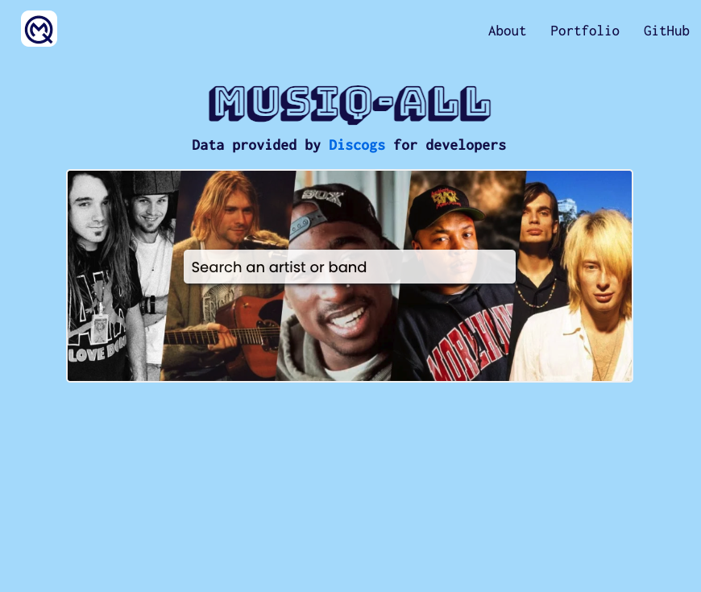
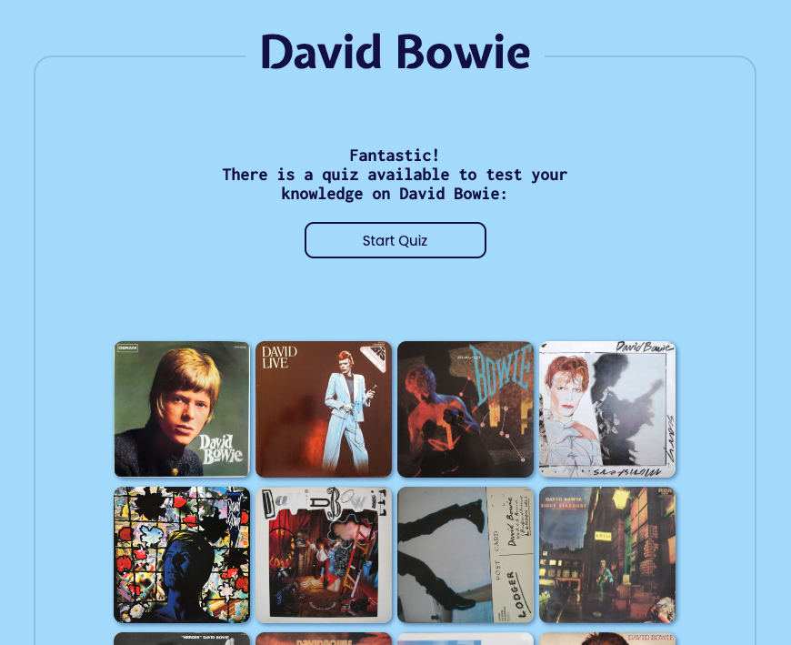
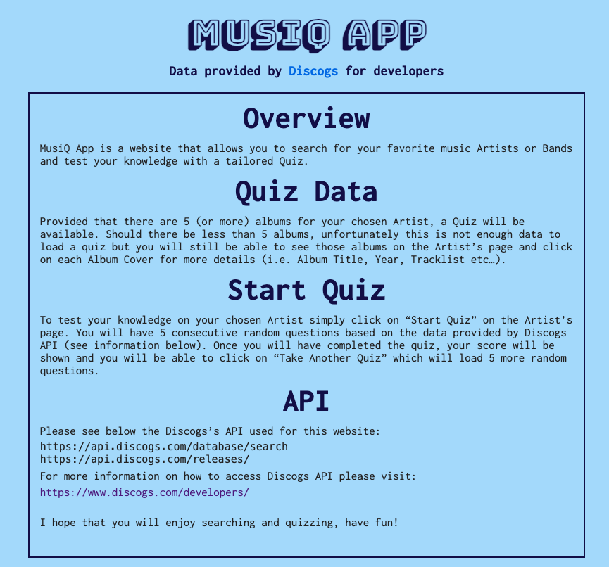

# MUSIQ ALL


## Project Description
**Musiq All** 
is a website that allows you to search for your favorite music Artists or Bands and test your knowledge with a tailored Quiz.
This website was built with React. 

## Deployment Link
 [https://musiq-all.co.uk/](https://musiq-all.co.uk/ "Musiq-All")

### API Links
 https://api.discogs.com/database/search

 https://api.discogs.com/releases/  

## Getting Started/Code Installation
Ensure that you have cloned repositories onto your machine and follow these steps:

1. In the front-end CLI, run `npm i` on the root level to install dependencies.
2. Then run the command `npm start` to run program in your local environment.


### Dependencies
* React 
* SASS
* Axios 


## Timeframe 
This personal project took 2 weeks to complete from the search of an API to deployment. 


## Technologies Used
* HTML/SASS/JavaScript
* React
* Visual Studio Code
* Postman
* Git/GitHub
* Axios packages
* Google Fonts
* Squarespace


## Technical Requirements

- **Consume an API** built with React
- **Aesthetically pleasing** using SASS
- **Responsive** to mobile/tablet/desktop using SASS
- **Accessible** using Accessibility Insights for Web Chrome extension

## API Research


  * Searched for an API which would allow multiple requests and have sufficient data to create a website 
  * Understand each endpoints limits by manipulating their data 
  * Analyzing data to plan the development of a quiz

## Build/Code Process

### Fetching Data from The API 

  * Created an account on Dicsogs.com in order to receive credentials to access their API directory
  * Used Postman to analyze data from each endpoints
  * **Search** endpoint required a significant amount of testing with multiple parameters (Artist Name, Country, Releases Type etc...)
  * **Releases** endpoint was much more straightforward as it only requires the **releaseID** however the data was not well organised at times and it required extra attention to be able to fetch the correct information

### Developing The React app

* Installation
  * Created a new repository on GitHub. 
  * Initial setup of the frontend application by installing the   dependencies:
    * Axios 
    * CORS 
    * SASS
    * Created a `.gitignore` file and added `“node module”; “.env”; “DS_store”`.
  * Added the boiler plate code to fetch data from both endpoints:

```javascript
import axios from 'axios';

const KEY = process.env.REACT_APP_API_KEY;
const SECRET = process.env.REACT_APP_API_SECRET;

const ENDPOINTS = {
  search: (query) =>
    `https://api.discogs.com/database/search?q=${query}&key=${KEY}&secret=${SECRET}`,
  getArtistAlbums: (query, country) =>
    `https://api.discogs.com/database/search?q=${query}&country=${country}&artist=${query}&type=release&format=album&artist=${query}&type=release&format=album&key=${KEY}&secret=${SECRET}`,
  getAlbum: (selectedAlbumId) =>
    `https://api.discogs.com/releases/${selectedAlbumId}`
};

const GET = (endpoint) => axios.get(endpoint);


export const API = { GET, ENDPOINTS };

```

### Developing The React app - Components

* Created the `NavBar` which allows the user to navigate between **Search(Homepage)** **About Page** and **Artist Page**. Added links to my GitHub/Portfolio pages. 

* Created `Search`, `Artist` `About` pages:





### Developing The React app - Styling
* Added styling to all pages using a color palette for uniformity
* As the website was first built for desktop, I implemented responsiveness to tablet and mobile.

### Developing The React app - Accessibility
* Using chrome extension, adjusted styling and functionalities to improve accessibility of the website.

## Challenges
* Understanding which API endpoint would be best to use and how to get the most information out of each one using parameters for example
* Manipulating data to show the correct information on screen
* Quiz functionality and conditioning 

## Wins
* The instant satisfaction to see the website come to life thanks to the data from the API
* Adding functionalities that I hadn't thought of originally was
really fun and enjoyable.

## Key Learning/Takeaways
* Data manipulating
* API limits 

## Bugs
* No visible bugs as tested on Chrome, please do not hesitate to get in touch if so!
* API data can sometimes have the wrong information, for example : wrong year given as a correct answer for the quiz

## Future Improvements
* Add more CSS transitions to make the website more appealing to the user

## THANKS FOR READING!

